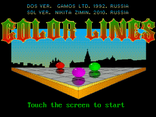

# SDL-ColorLines

Original nzimin version with updates

## Toolchain & SDK

TODO: Add link to SDK

## Install Tools & Build

## Copy executable file to console

Use usb mini cable, or just copy ColorLines folder to SD card

## Controls

 - Joystick - directions
 - A - select
 - Y - new game
 - X - pause music
 - Select - back to menu
 - Start - about

## Features

 - Game save your score automatically
 - Music and effects

## Screenshots

