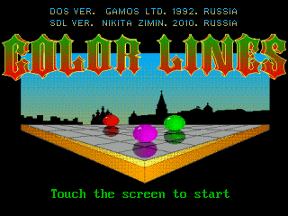
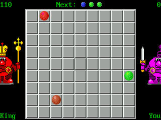
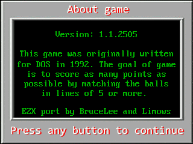

# SDL-ColorLines

Dingux (OpenDingux) version, ported from A320 native OS

## Toolchain & SDK

TODO: Add link to SDK

## Install Tools & Build

Debian Recipe:

```sh
sudo mkdir /opt/toolchains/
sudo tar -C /opt/toolchains/ -xzvf ~/Downloads/dingux_sdk.zip

cd ~/Projects/
git clone https://github.com/Limows/SDL-ColorLines
cd SDL-ColorLines/Dingux/
. /opt/toolchains/dingux/setenv-dingux.sh
make clean
make
```

## Copy executable file to console

Use usb mini cable, or just copy ColorLines folder to SD card

## Controls

 - Joystick - directions
 - A - select
 - Y - new game
 - Select - back to menu
 - Start - about

## Features

 - Game save your score automatically

## Screenshots




