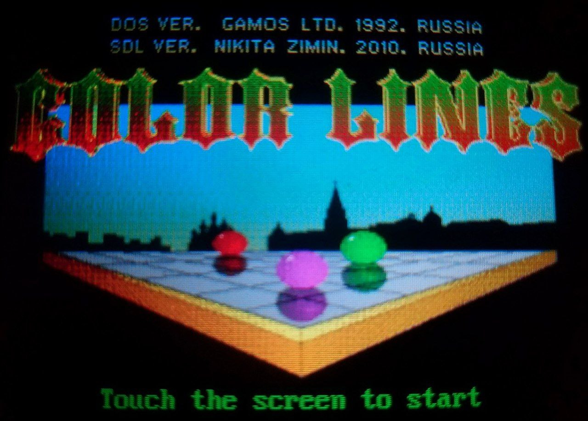
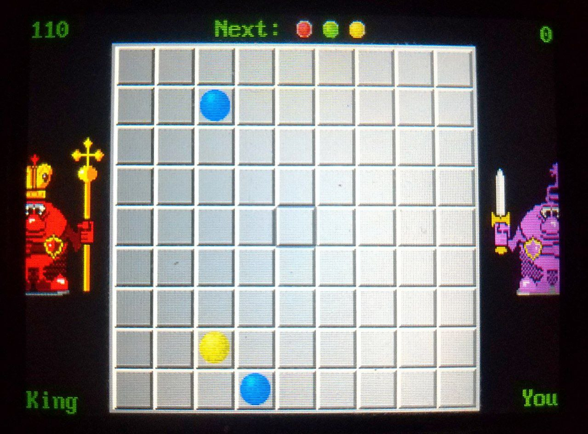
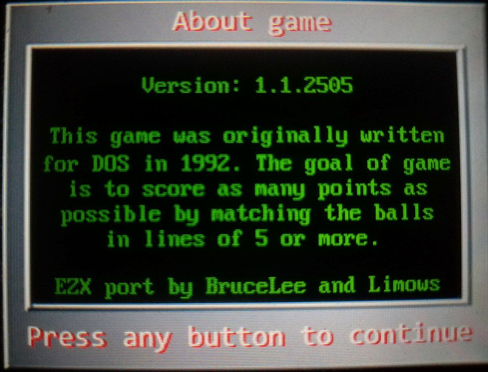

# SDL-ColorLines

Motorola EZX version, originally ported by BruceLee

## Toolchain & SDK

Motorola A1200, E6: [here](http://www.mediafire.com/?meqnmgujgjq)

Motorola A780, E680: [here](https://code.google.com/archive/p/moto-e680-develop/downloads)

## Install Tools & Build

CentOS 7 Recipe:

```sh
sudo yum -y install epel-release

sudo yum -y install @development
sudo yum -y install glibc.i686 libstdc++.i686
sudo yum -y install p7zip

sudo mkdir /opt/toolchains/
sudo tar -C /opt/toolchains/ -xzvf ~/Downloads/motoezx-toolchains*.tar.gz* # A1200, E6
sudo tar -C /opt/toolchains/ -xzvf ~/Downloads/motoe680-toolchains*.tar.gz* # A780, E680
sudo ln -s /opt/toolchains/motoe680 /usr/local/arm # A780, E680

cd ~/Projects/
git clone https://github.com/Limows/SDL-ColorLines
cd SDL-ColorLines/EZX/
. /opt/toolchains/motoezx/setenv-a1200-devezx.sh # A1200, E6
make clean
make # A1200, E6
```

## Copy executable file to phone and run it

FTP:

```sh
ftp 192.168.16.2
User: ezx
ftp> binary
ftp> cd /mmc/mmca1/
ftp> mput ColorLines
ftp> quit
```
or just use FileZilla :)

## Create PKG-package for Motorola E6 or A1200

PKG:

```sh
tar -cvzf ColorLines.pkg ColorLines
```

MPKG:

```sh
tar -cvzf ColorLines.mpkg --numeric-owner --owner=2000 --group=233 ColorLines
```

## Controls

 - Joystick - directions
 - Camera or Plus or Joystick center - select
 - Minus - new game
 - Hangup - back to menu
 - Ring - about

## Features

 - Game save your score automatically

## Tested devices

 - Motorola A1200

## Screenshots

- Running on Motorola A1200:




