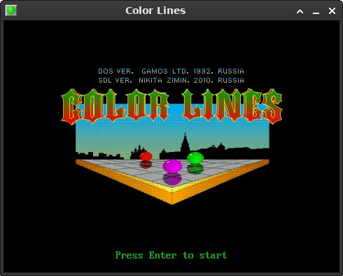
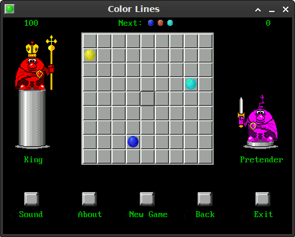

# SDL-ColorLines

SDL Haiku and BeOS version

## Install Tools & Build

Haiku Recipe:

```sh
pkgman install libsdl-dev
pkgman install sdl_mixer-dev

cd ~/Projects/
git clone https://github.com/Limows/SDL-ColorLines
cd SDL-ColorLines/Haiku/
make clean
make
```

## Create package

```sh
package create -C ./ColorLines colorlines-x86_gcc2.hpkg
```

## Controls

 - Cursor keys - directions
 - Enter - select
 - F6 - new game
 - F2 - pause music
 - ESC - back to menu
 - F4 - about

## Features

 - Game save your score automatically
 - Music
 - Animations
 - Mouse controls

## Tested devices

 - VirtualBox VM

## Screenshots

- On Haiku:




