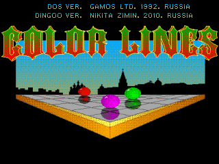

# SDL-ColorLines

Forked and updated version of SDL re-implementation of classic Color Lines game, originally written by Nikita Zimin in 2010

## Versions

 - EZX - Motorola EZX platform
 - A320 - Dingoo A320 handheld
 - RZX50 - Ritmix RZX50 handheld
 - X86-Linux - Default PC

## Contributing

Bug reports and pull requests are welcome on GitHub at https://github.com/Limows/SDL-ColorLines.

## License

This project is licensed under the terms of the [2-Clause BSD License](https://opensource.org/licenses/BSD-2-Clause).
