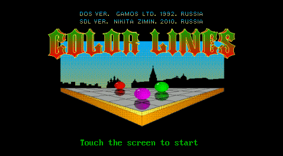
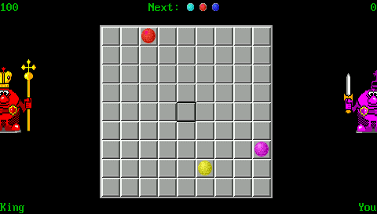
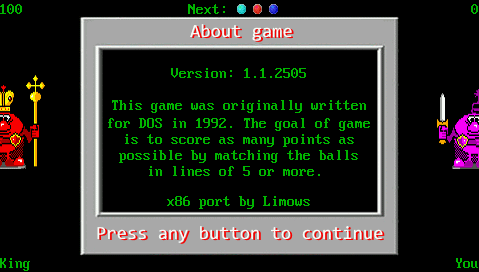

# SDL-ColorLines

Ritmix RZX50 version, ported by Limows with EXL help

## Toolchain & SDK

Download SDK from original [site](http://old.ritmixrussia.ru/products/rzx-50)

## Install Tools & Build

Debian Recipe:

```sh
sudo mkdir /opt/toolchains/
sudo tar -C /opt/toolchains/ -xzvf ~/Downloads/rzx50_sdk.zip

cd ~/Projects/
git clone https://github.com/Limows/SDL-ColorLines
cd SDL-ColorLines/RZX50/
. /opt/toolchains/mipsel-linux-uclibc/setenv-rzx.sh
make clean
make
```

## Copy executable file to console

Use usb mini cable, or just copy ColorLines folder to SD card

## Controls

 - Joystick - directions
 - A - select
 - Y - new game
 - X - pause music
 - Select - back to menu
 - Start - about

## Features

 - Game save your score automatically
 - Music

## Screenshots




