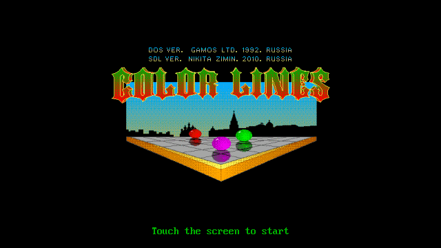
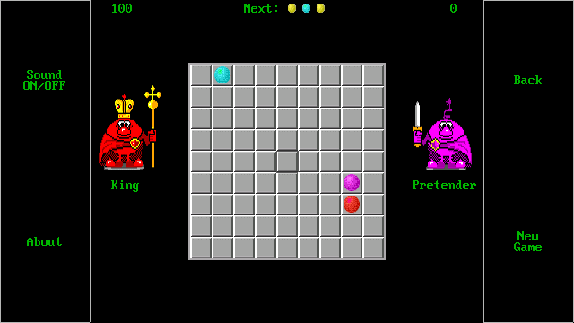
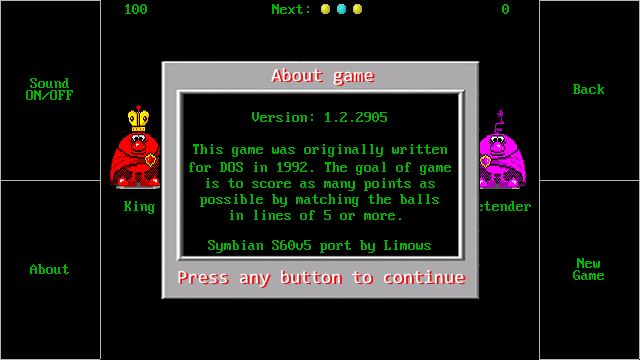

# SDL-ColorLines

Version for Symbian S60v5 and Symbian^3 (Anna, Belle)

## Toolchain & SDK

Symbian QT SDK: [here](https://mrrosset.github.io/Symbian-Archive/SDKs-Langs.html)

SDL for Symbian: [here](https://sourceforge.net/projects/sdlforsymbian/files/)

## Install Tools & Build

Copy libs to /QtSDK/Symbian/SDKs/Symbian1Qt473/epoc32/release 
and headers to /QtSDK/Symbian/SDKs/Symbian1Qt473/epoc32/include

Open project in Qt Creator and build it using Qt 4.7.3 for Symbian^1 build config

## Copy executable file to phone and run it

Use Nokia PC Suite to install SIS files of game and SDL library

## Create package

It will be auto-created in Qt Creator

## Controls

 - Joystick - directions
 - Joystick center or Enter - select
 - CTRL - new game
 - BackSpace - back to menu
 - Space - about

On phones without keyboads, such as Nokia 5800, use on screen buttons 

## Features

 - Game save your score automatically
 - Touch-screen controls

## Tested devices

 - Nokia C6
 - Nokia 5530

## Screenshots

