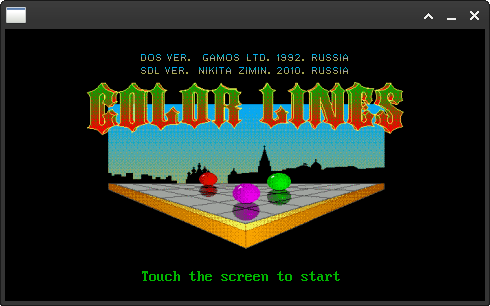
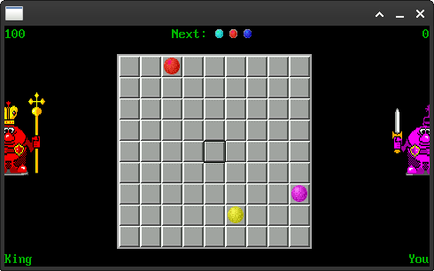
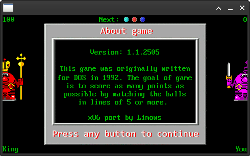

# SDL-ColorLines

SDL Linux version

## Install Tools & Build

Debian Recipe:

```sh
sudo apt install libsdl*1.2-dev

cd ~/Projects/
git clone https://github.com/Limows/SDL-ColorLines
cd SDL-ColorLines/X86-Linux/
make clean
make
```

## Create packages for Linux distributions

## Controls

 - Cursor keys - directions
 - Enter - select
 - F1 - new game
 - ESC - back to menu
 - F12 - about

## Features

 - Game save your score automatically

## Tested devices

 - Thinkpad T470 with Debian sid

## Screenshots

- On Debian sid:




